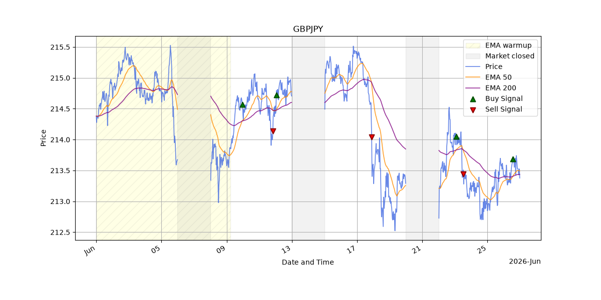
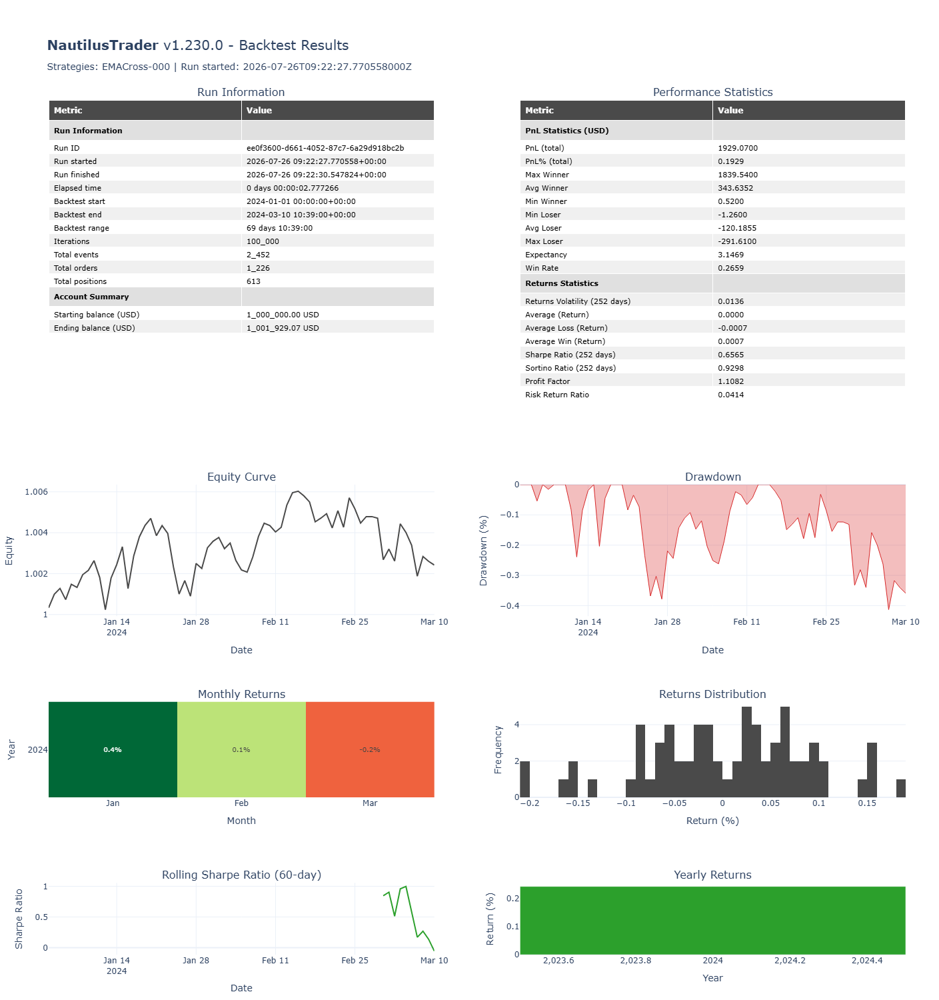

# Trading Bot

## Overview
A Python-based algorithmic trading system implementing an Exponential Moving Average (EMA) crossover strategy with MetaTrader5 integration and NautilusTrader-powered backtesting. The system retrieves market data, processes technical indicators, identifies trading signals, manages risk-based position sizing, and evaluates strategy performance against historical data.

## Tech Stack
- Python
- MetaTrader5
- NautilusTrader

## Key Features
- Connects to MetaTrader5 and retrieves historical price data
- Calculates EMA indicators and detects crossover signals
- Supports multiple currency pairs and configurable timeframes
- Backtests trading strategies using NautilusTrader's event-driven backtesting engine

## Backtesting Results

## How to Run
1. Install MetaTrader5  
2. Install dependencies: `py -m pip install -r requirements.txt`  
3. Add your MT5 credentials in a `.env` file  
4. Run: `python main.py`